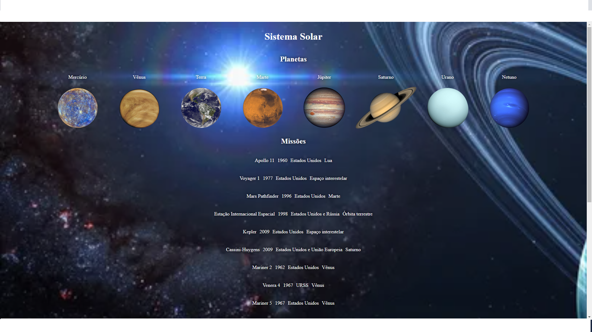

<strong> 🔰 Iniciando o projeto</strong>
 

1. Clone o repositório
   `git clone git@github.com:Rafael-Friedel/Project-Solar-System.git `

- Entre na pasta do repositório que você acabou de clonar:

  - `cd Project-Solar-System`

  - Instale as dependências [**Caso existam**] \*`npm install`

  - Inicie o projeto para visualizar \*`npm start`

Projeto realizado para aplicar habilidades desenvolvidas no Bloco-10 - Introdução a React.

Projeto realizado 100% dos requisitos obrigatórios e 100% dos requisitos totais.

Entregue dentro de 12 horas de programação.
